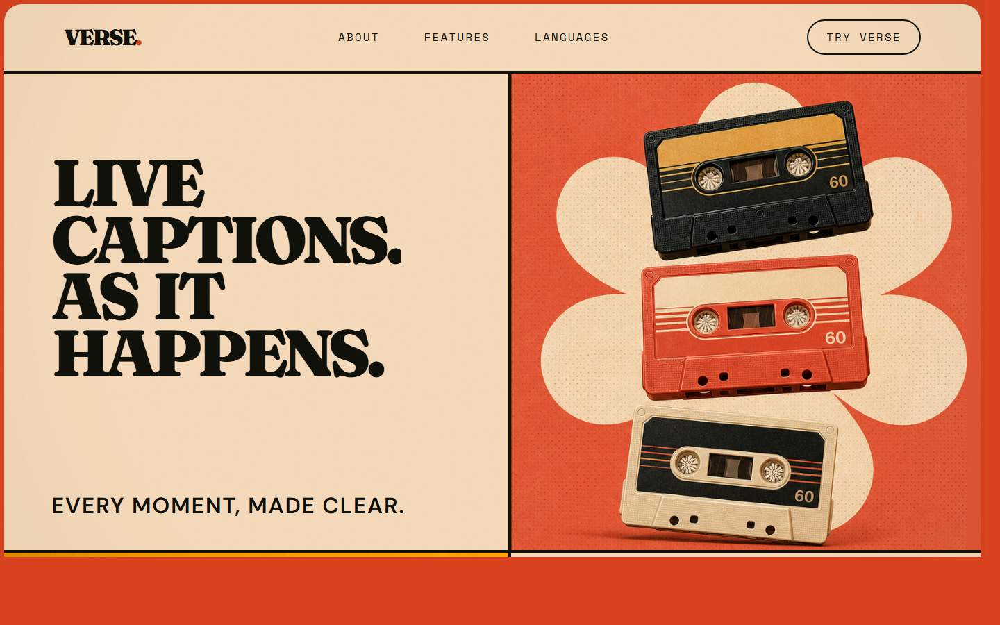
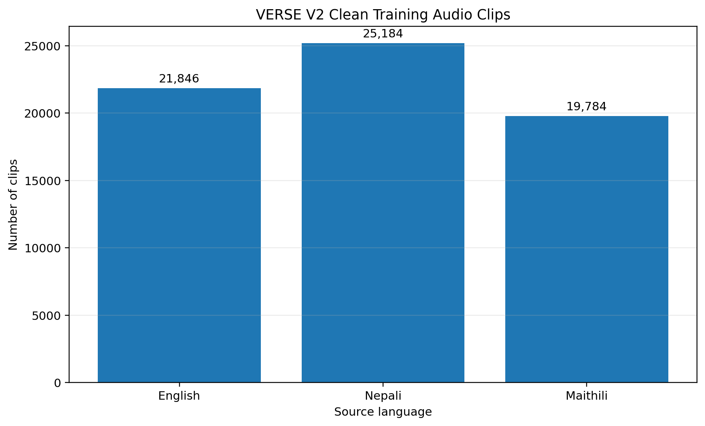
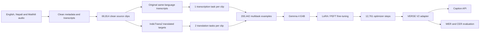
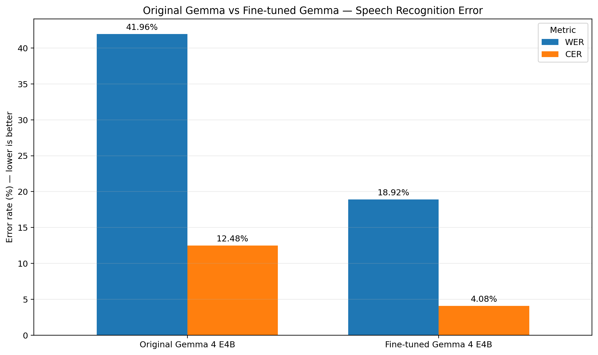
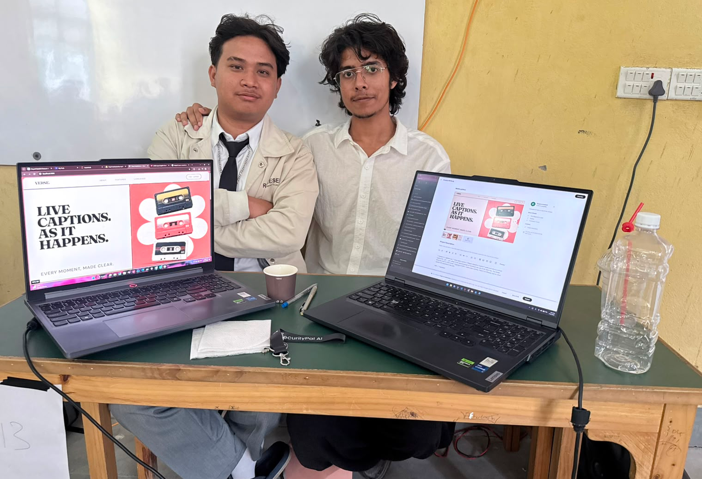

<div align="center">

# VERSE

### Every moment, made clear.

Multilingual speech recognition, translation, and live captions for English, Nepali, and Maithili.


</div>



> [!IMPORTANT]
> **The public GPU endpoint is temporarily offline because our RunPod credit balance was exhausted during fine-tuning and evaluation. We sincerely apologize.** The complete model-backed API is now included in `backend/`, and **Try Verse no longer uses prepared or hardcoded caption tracks**: it calls that API for fresh VERSE V2 inference. Reviewers can run the backend on their own NVIDIA GPU and point the frontend to it with `NEXT_PUBLIC_VERSE_API_URL`. We will restore the hosted GPU endpoint as soon as GPU access is available again.

## Overview

Verse is a multilingual captioning system built by **Team Northlight** for the **Gemma Margadarshan Hackathon**. It combines a fine-tuned Gemma speech model with a responsive web experience for turning uploaded audio, uploaded video, or shared video links into readable captions.

**VERSE V2** is based on **Gemma 4 E4B** and is trained for both same-language transcription and cross-language speech-to-text translation. The web application presents the caption workflow in a responsive interface designed for phones, tablets, laptops, and desktops.

## How Verse uses Gemma

Gemma 4 E4B is not a component of Verse, it is the whole model. Audio goes in and caption text comes out of the same network, so there is no Whisper, no cloud speech API, and no separate ASR stage anywhere in the path.

Training lives in [`backend/train_v2.py`](backend/train_v2.py), while production inference lives in [`backend/app/`](backend/app/). The training code loads `unsloth/gemma-4-e4b-it-unsloth-bnb-4bit`, attaches the LoRA/PEFT adapter, builds each example as a conversation with an `audio` content block, and trains with `SFTTrainer`. The runtime follows the same architecture: Gemma 4 E4B base weights plus the public [VERSE V2 adapter on Hugging Face](https://huggingface.co/Aashishhhhhhhh/verse-v2-nepali-maithili).

One adapter covers nine behaviours rather than nine systems. Which behaviour you get is selected by the instruction in the prompt, not by a router, and that works only because Gemma 4 follows instructions and accepts audio in the same model. The alternative is an ASR stage followed by a separate translation stage whose errors compound on top of the first stage's.

E4B was chosen deliberately. Captioning is sensitive to both latency and privacy, and the settings this is aimed at are classrooms, clinics and government service desks, where sending a hard-of-hearing user's appointment audio to a cloud API is the wrong default. The edge-deployable variant keeps on-device deployment reachable later instead of designing it out at the start.

## What Verse can do

### Same-language transcription

- English audio → English text
- Nepali audio → Nepali text
- Maithili audio → Maithili text

### Speech-to-text translation

- English audio → Nepali or Maithili text
- Nepali audio → English or Maithili text
- Maithili audio → English or Nepali text

### Product experience

- Upload local audio and video files.
- Share supported video URLs.
- Switch between English, Nepali, and Maithili caption tracks.
- Preview synchronized captions in the browser.
- Use a keyboard-accessible, responsive interface with reduced-motion support.

## Who Verse is for

Before writing model code we emailed the organisations who would have to live with the result. The National Federation of the Deaf Nepal and the National Federation of the Disabled Nepal both replied, and both told us the same thing: captions are a valuable accessibility tool for many hard-of-hearing people, but Nepali Sign Language interpretation is essential for Deaf people whose primary language is NSL, and captions are not a replacement for it.

So Verse is not a Deaf accessibility product. It is captioning for hard-of-hearing people, for people who lost hearing later in life, and for deafblind users whose assistive technology reads text. Both replies are in [`docs/outreach.md`](docs/outreach.md).

## Model at a glance

| Item | VERSE V2 configuration |
| --- | --- |
| Base model | `unsloth/gemma-4-e4b-it-unsloth-bnb-4bit` |
| Public adapter | [`Aashishhhhhhhh/verse-v2-nepali-maithili`](https://huggingface.co/Aashishhhhhhhh/verse-v2-nepali-maithili) |
| Architecture | Gemma 4 E4B instruction-tuned |
| Fine-tuning method | LoRA / PEFT |
| Trainable parameters | 18,350,080 |
| Approximate trainable share | 0.23% |
| Epochs | 1 |
| Per-device batch size | 16 |
| Final optimizer step | 12,761 |
| Final release | V2 adapter from `checkpoint-12761` |
| Training task examples | 200,442 |

Only the LoRA parameters were updated; the compatible Gemma base weights remain the foundation of the model.

## Training data

The source corpus is [`Firoj112/chatterbox-multilingual-data`](https://huggingface.co/datasets/Firoj112/chatterbox-multilingual-data). Audio metadata and transcripts were cleaned before retaining English, Nepali, and Maithili clips.

### Clean source audio

| Source language | Clean clips |
| --- | ---: |
| English | 21,846 |
| Nepali | 25,184 |
| Maithili | 19,784 |
| **Total** | **66,814** |



Each clean source clip produced three supervised tasks:

```text
1 same-language transcription task
+
2 cross-language translation tasks
=
3 examples per source clip
```

| Task type | Examples |
| --- | ---: |
| Transcription | 66,814 |
| Speech translation | 133,628 |
| **Total training examples** | **200,442** |

The validation split contains **3,712 source clips**, expanded into **11,136 multitask examples**.

## Development pipeline



## Preparing translation targets

The original corpus provides audio with same-language transcripts. Missing cross-language supervision targets were prepared with three IndicTrans2 models:

- `AI4Bharat/indictrans2-en-indic-200M`
- `AI4Bharat/indictrans2-indic-en-200M`
- `AI4Bharat/indictrans2-indic-indic-320M`

IndicTrans2 was used only during dataset preparation. It did not generate source audio and is not required for final Verse inference.

## Training infrastructure

| Environment | GPU | Role |
| --- | --- | --- |
| Google Colab | NVIDIA A100 | Experiments, pipeline validation, and training runs |
| RunPod | NVIDIA B200 | High-memory V2 fine-tuning and checkpoint completion |

The final V2 adapter was completed at optimizer step **12,761**. The adapter format keeps the release substantially smaller than a merged full-model checkpoint.

## Evaluation

### Original vs. fine-tuned comparison

| Model | Word Error Rate | Character Error Rate |
| --- | ---: | ---: |
| Original Gemma 4 E4B | 41.96% | 12.48% |
| Fine-tuned Gemma 4 E4B | **18.92%** | **4.08%** |

In this comparison run, fine-tuning reduced relative WER by approximately **54.9%** and relative CER by approximately **67.3%**.



### Quick V2 validation

The following preliminary check used 5 clips per source language, or 15 clips total:

| Language | Samples | WER | CER |
| --- | ---: | ---: | ---: |
| English | 5 | 6.72% | 3.05% |
| Nepali | 5 | 8.20% | 1.57% |
| Maithili | 5 | 30.36% | 6.45% |
| **Combined** | **15** | **12.35%** | **3.44%** |

Lower WER and CER are better. This 15-clip check is a preliminary validation result, not a final benchmark or state-of-the-art claim. It is reported separately from the larger original-vs-fine-tuned comparison above, and the two should not be plotted against each other: there is no baseline decode on these same 15 clips, so the table describes V2 on its own. The console output is in [`docs/screenshots/quick-validation-run.png`](docs/screenshots/quick-validation-run.png).

The next step for evaluation is decoding both models over one larger held-out set and reporting a single matched comparison.

## System flow

```text
Video URL / audio file / video file
                 ↓
        speech preprocessing
                 ↓
          VERSE V2 adapter
        + Gemma 4 E4B base
                 ↓
     timestamped caption segments
                 ↓
 English / Nepali / Maithili playback
```

The included caption service exposes:

```text
GET  /api/health
POST /api/caption
```

The caption request accepts a media file (or a public `video_url`), `source_language`, and `target_language`. Language codes are `en`, `ne`, and `mai`. Uploaded audio/video is converted to mono 16 kHz float32 audio, split into overlapping 25-second chunks, decoded sequentially, and joined with boundary deduplication.

## Technology

- Gemma 4 E4B, Unsloth, PEFT, and LoRA
- Hugging Face Transformers
- IndicTrans2 by AI4Bharat for supervision-label preparation
- React 19, TypeScript, and a Next.js-compatible Vinext application
- GSAP, Lenis, and Anime.js for interface motion
- Cloudflare Workers-compatible production build

## Repository scope

This repository contains the Verse web experience, the VERSE V2 caption API, and the V2 training code. The full training corpus, model checkpoints, and private training workspace are not committed here. The public release is a **LoRA/PEFT adapter** and must be loaded on top of the compatible Gemma base weights.

`backend/` contains both the reproducible training script and the self-hosted FastAPI inference service. The service loads the Gemma base and public adapter once at startup, processes uploads and public video URLs, and exposes health and caption endpoints. `frontend/` keeps the existing Verse interface and sends the selected source language, target language, and media to that service.

Training ran in our own Google Colab and RunPod accounts, which is why the checkpoints, the 200,442 example manifest, and the run logs live there instead of here. Anyone who wants to see them can ask, see [Contact](#contact).

## Live inference availability

The VERSE V2 adapter was fine-tuned and evaluated on RunPod. Our RunPod credit balance was exhausted during that work, so the team cannot currently keep a public GPU endpoint online. We sincerely apologize for this temporary limitation.

The repository does not hide that limitation or substitute hardcoded output. The **Try Verse** page now calls the included `/api/caption` service and displays the fresh result in its existing caption area. Without a configured GPU backend it reports the service as unavailable. Reviewers with a Linux NVIDIA environment can run the complete inference path locally using the instructions below and the public [VERSE V2 Hugging Face adapter](https://huggingface.co/Aashishhhhhhhh/verse-v2-nepali-maithili).

As soon as GPU credits are restored, we will deploy this same backend and set the production `NEXT_PUBLIC_VERSE_API_URL`; no frontend redesign or caption-table swap is required.

## Run locally

### Frontend requirements

- Node.js 22.13 or newer
- npm

### Clone and start the frontend

```bash
git clone https://github.com/AashishThakuri/-Gemma_Margadarshan_hackathon_Team_Northlight.git
cd -- -Gemma_Margadarshan_hackathon_Team_Northlight
cd frontend
npm install
cp .env.example .env.local
npm run dev
```

On Windows PowerShell, use `Copy-Item .env.example .env.local` instead of `cp`. Open [http://localhost:3000](http://localhost:3000); the caption workspace is at [http://localhost:3000/try-verse](http://localhost:3000/try-verse).

### Start the VERSE V2 backend

The model runtime requires Linux, `ffmpeg`, an NVIDIA CUDA GPU, Python 3.10 or 3.11, and enough VRAM for the 4-bit Gemma E4B base plus the adapter. At least 16 GB VRAM is recommended; the A100 and B200 environments used during development provide more headroom.

```bash
cd backend
python -m venv .venv
source .venv/bin/activate
pip install --upgrade pip
pip install -r requirements.txt
cp .env.example .env
uvicorn app.main:app --host 0.0.0.0 --port 8000 --env-file .env
```

The frontend example already points to `http://localhost:8000`. Confirm startup with:

```bash
curl http://localhost:8000/api/health
```

Generate a Nepali-to-English caption with:

```bash
curl -X POST http://localhost:8000/api/caption \
  -F "file=@sample.mp3" \
  -F "source_language=ne" \
  -F "target_language=en"
```

Same source and target codes perform transcription; different codes perform speech translation. All nine combinations of `en`, `ne`, and `mai` are supported.

### Environment variables

| Variable | Default |
| --- | --- |
| `VERSE_BASE_MODEL` | `unsloth/gemma-4-e4b-it-unsloth-bnb-4bit` |
| `VERSE_ADAPTER_MODEL` | `Aashishhhhhhhh/verse-v2-nepali-maithili` |
| `VERSE_MAX_UPLOAD_MB` | `250` |
| `VERSE_CHUNK_SECONDS` | `25` |
| `VERSE_ALLOWED_ORIGINS` | `http://localhost:3000,http://127.0.0.1:3000` |
| `NEXT_PUBLIC_VERSE_API_URL` | `http://localhost:8000` |

### Verify the project

```bash
cd frontend && npm test
cd ../backend && VERSE_SKIP_MODEL_LOAD=1 pytest -q
```

## Project structure

```text
frontend/
|-- app/
|   |-- page.tsx              # Landing, About, Features, and footer
|   `-- try-verse/page.tsx    # Video/audio intake and caption demo
|-- public/                   # Artwork, screenshots, and evaluation graphs
|-- tests/                    # Rendered-page smoke tests
`-- worker/                   # Cloudflare-compatible worker entry
backend/
|-- app/
|   |-- main.py               # FastAPI health and caption routes
|   |-- model_service.py      # Gemma base + VERSE V2 adapter inference
|   |-- audio.py              # Media normalization and chunking
|   `-- prompts.py            # All nine language task prompts
|-- tests/                    # API, prompt, and chunking tests
|-- requirements.txt          # GPU backend dependencies
`-- train_v2.py               # VERSE V2 LoRA/PEFT training code
docs/
|-- kaggle-submission.md      # The writeup submitted to Kaggle
|-- outreach.md               # NDFN and NFDN replies, and what changed because of them
|-- pitch/                    # Presentation deck, .pptx and self-contained .html
`-- screenshots/              # Evaluation run, product pages, correspondence, team
```

## Documentation

| Document | What is in it |
| --- | --- |
| [`docs/README.md`](docs/README.md) | Index, plus which evaluation number came from which run |
| [`docs/kaggle-submission.md`](docs/kaggle-submission.md) | The writeup text submitted to Kaggle on 31 July 2026 |
| [`docs/outreach.md`](docs/outreach.md) | The NDFN and NFDN replies that set the scope of the project |
| [`docs/pitch/`](docs/pitch/) | Presentation deck. Open `verse-pitch.html` in a browser for a self-contained version |

## Limitations

- Maithili WER is currently higher than English and Nepali WER.
- The quick V2 validation sample is too small for a conclusive benchmark.
- Translation supervision partly relies on IndicTrans2-generated targets.
- Noise, music, overlapping speakers, rare dialects, code-switching, and long recordings may reduce accuracy.
- A larger untouched test set is required before production or high-stakes use.
- The adapter requires the compatible Gemma 4 E4B base model.

## Attribution

Verse V2 was built with Gemma 4 by Google DeepMind, Unsloth, Hugging Face Transformers and PEFT, IndicTrans2 by AI4Bharat, the `Firoj112/chatterbox-multilingual-data` corpus, Google Colab, and RunPod.

Users must follow the terms of the Gemma base model, source dataset, IndicTrans2 models, and all other dependencies. Evaluate the model independently before production or high-stakes deployment.

## Team

Built by **Team Northlight** for the **Gemma Margadarshan Hackathon**.



## Contact

The training runs, checkpoints, and evaluation outputs live in our own Google Colab and RunPod accounts rather than in this repository. If judges or anyone else want to see them, just ask. We are happy to share access to the Colab notebooks and the RunPod workspace, walk through the training logs and checkpoint directory, or answer any other question about how a number was produced.

| Name | Phone | Email |
| --- | --- | --- |
| Praful Bhatt | 9808607050 | praful2062@gmail.com |
| Aashish Thakuri | 9862557932 | |

---

<div align="center">
  <strong>VERSE — LIVE CAPTIONS AS THEY HAPPEN.</strong>
</div>
