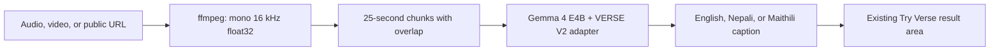

<div align="center">

# VERSE

### Every moment, made clear.

Multilingual speech recognition, translation, and live captions for English, Nepali, and Maithili.


</div>


## Requirements to run

- Backend: Linux, Windows, or Windows through WSL2 with Python 3.10/3.11 and `ffmpeg`
- Backend: NVIDIA CUDA GPU with at least 16 GB VRAM recommended
- Frontend: Windows, macOS, or Linux with Node.js 22.13+ and npm
- Internet access for the first public base-model and adapter download

macOS can run the frontend, but this repository's current 4-bit Unsloth backend requires NVIDIA CUDA. On a Mac, set `NEXT_PUBLIC_VERSE_API_URL` to a backend running on a Linux or Windows NVIDIA machine.

Follow [Run locally](#run-locally) to start the caption API and website.

## What is Verse?

Verse is Team Northlight’s Gemma Margadarshan Hackathon project: one fine-tuned Gemma model that turns uploaded audio, video, or a public video URL into English, Nepali, or Maithili text.

- Same-language transcription: `en → en`, `ne → ne`, `mai → mai`
- Speech translation: every cross-language direction between `en`, `ne`, and `mai`
- Responsive frontend with upload, URL intake, language selection, loading, and result states
- Self-hosted FastAPI backend; no Whisper, cloud speech API, or hidden fallback model

## Model and results

| Item | VERSE V2 |
| --- | --- |
| Base model | `unsloth/gemma-4-e4b-it-unsloth-bnb-4bit` |
| Public adapter | [Aashishhhhhhhh/verse-v2-nepali-maithili](https://huggingface.co/Aashishhhhhhhh/verse-v2-nepali-maithili) |
| Fine-tuning | LoRA / PEFT, 18,350,080 trainable parameters |
| Training | 1 epoch, batch size 16, 12,761 optimizer steps |
| Infrastructure | Google Colab A100 + RunPod B200 |
| Original Gemma | WER 41.96%, CER 12.48% |
| Fine-tuned Gemma | **WER 18.92%, CER 4.08%** |

The public release is a PEFT adapter and must be loaded on top of the compatible Gemma base model.

## Training data

The source corpus is [Firoj112/chatterbox-multilingual-data](https://huggingface.co/datasets/Firoj112/chatterbox-multilingual-data). After cleaning:

| Language | Audio clips |
| --- | ---: |
| English | 21,846 |
| Nepali | 25,184 |
| Maithili | 19,784 |
| **Total** | **66,814** |

Each clip produced one transcription task and two translation tasks: **200,442 training examples**. The validation set contains **3,712 source clips / 11,136 task examples**. IndicTrans2 generated missing cross-language supervision targets; it is not part of final inference.


## How it works



The backend loads the base model and adapter once at startup. Long media is processed sequentially with one-second overlap and boundary deduplication.

```text
GET  /api/health
POST /api/caption
```

`POST /api/caption` accepts `file` or `video_url`, plus `source_language` and `target_language` (`en`, `ne`, `mai`).

## Run locally

### 1. Clone

```bash
git clone https://github.com/AashishThakuri/-Gemma_Margadarshan_hackathon_Team_Northlight.git
cd -- -Gemma_Margadarshan_hackathon_Team_Northlight
```

### 2. Start the backend

Requires Python 3.10/3.11, `ffmpeg`, CUDA-enabled PyTorch, and an NVIDIA GPU with at least 16 GB VRAM recommended. Linux, native Windows, and WSL2 are supported. Install the correct CUDA PyTorch build for your driver before installing the requirements.

```bash
cd backend
python -m venv .venv
source .venv/bin/activate
pip install -r requirements.txt
cp .env.example .env
uvicorn app.main:app --host 0.0.0.0 --port 8000 --env-file .env
```

Windows PowerShell uses the same service:

```powershell
cd backend
python -m venv .venv
.\.venv\Scripts\Activate.ps1
pip install -r requirements.txt
Copy-Item .env.example .env
python -m uvicorn app.main:app --host 0.0.0.0 --port 8000 --env-file .env
```

### 3. Start the frontend

Requires Node.js 22.13+.

```bash
cd ../frontend
npm install
cp .env.example .env.local
npm run dev
```

Open [http://localhost:3000](http://localhost:3000) or [Try Verse](http://localhost:3000/try-verse). On PowerShell, replace `cp` with `Copy-Item`.

### API example

```bash
curl -X POST http://localhost:8000/api/caption \
  -F "file=@sample.mp3" \
  -F "source_language=ne" \
  -F "target_language=en"
```

## Environment

```env
VERSE_BASE_MODEL=unsloth/gemma-4-e4b-it-unsloth-bnb-4bit
VERSE_ADAPTER_MODEL=Aashishhhhhhhh/verse-v2-nepali-maithili
VERSE_MAX_UPLOAD_MB=250
VERSE_CHUNK_SECONDS=25
NEXT_PUBLIC_VERSE_API_URL=http://localhost:8000
```

## Verify

```bash
cd frontend && npm test
cd ../backend && VERSE_SKIP_MODEL_LOAD=1 pytest -q
```

The CPU-safe suite verifies the frontend build, rendered pages, health endpoint, multipart uploads, all nine language prompts, media normalization, chunking, and deduplication. Actual caption quality must be verified on the NVIDIA runtime.

## Repository

```text
frontend/            Responsive Verse website and Try Verse interface
backend/app/         FastAPI routes, media pipeline, prompts, model service
backend/train_v2.py  VERSE V2 LoRA/PEFT training code
backend/tests/       Backend API and processing tests
docs/                Evaluation evidence, outreach, write-up, and pitch
```

## Scope and limitations

- Maithili WER remains higher than English and Nepali.
- Noise, music, overlapping speakers, dialects, code-switching, and long recordings may reduce accuracy.
- Captioning supports many hard-of-hearing users but does not replace Nepali Sign Language for Deaf users whose primary language is NSL. See [outreach evidence](docs/outreach.md).
- Evaluate the model independently before production or high-stakes use.

## Team

Built by **Team Northlight** for the **Gemma Margadarshan Hackathon**.


Verse was built with Gemma, Unsloth, PEFT, Hugging Face Transformers, IndicTrans2, React, Vinext, FastAPI, Google Colab, and RunPod.
