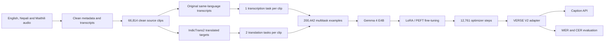

<div align="center">

# VERSE

### Every moment, made clear.

Multilingual speech recognition, translation, and live captions for English, Nepali, and Maithili.


</div>


> [!IMPORTANT]
> **Live Gemma inference is temporarily unavailable.** Our RunPod GPU credit balance was exhausted after fine-tuning and evaluation, so we cannot keep the VERSE V2 endpoint publicly online right now. We sincerely apologize. The **Try Verse** demo uses prepared, synchronized English, Nepali, and Maithili caption tracks to show exactly how output from our fine-tuned Gemma model appears in the live-caption interface; it is not presented as fresh browser inference. We will restore the model-backed `/caption` endpoint as soon as GPU access is available again.

## Overview

Verse is a multilingual captioning system built by **Team Northlight** for the **Gemma Margadarshan Hackathon**. It combines a fine-tuned Gemma speech model with a responsive web experience for turning uploaded audio, uploaded video, or shared video links into readable captions.

**VERSE V2** is based on **Gemma 4 E4B** and is trained for both same-language transcription and cross-language speech-to-text translation. The web application presents the caption workflow in a responsive interface designed for phones, tablets, laptops, and desktops.

## How Verse uses Gemma

Gemma 4 E4B is not a component of Verse, it is the whole model. Audio goes in and caption text comes out of the same network, so there is no Whisper, no cloud speech API, and no separate ASR stage anywhere in the path.

The integration lives in [`backend/train_v2.py`](backend/train_v2.py). That file is the actual LoRA / PEFT fine-tune of `unsloth/gemma-4-e4b-it-unsloth-bnb-4bit`: it loads the base model with `FastModel.from_pretrained`, attaches the adapter, builds each training example as a conversation with an `audio` content block in the user turn, and trains with `SFTTrainer`. The base model id, the multitask conversation format, and the exact training arguments the V2 adapter was produced with are all there to read.

One adapter covers nine behaviours rather than nine systems. Which behaviour you get is selected by the instruction in the prompt, not by a router, and that works only because Gemma 4 follows instructions and accepts audio in the same model. The alternative is an ASR stage followed by a separate translation stage whose errors compound on top of the first stage's.

E4B was chosen deliberately. Captioning is sensitive to both latency and privacy, and the settings this is aimed at are classrooms, clinics and government service desks, where sending a hard-of-hearing user's appointment audio to a cloud API is the wrong default. The edge-deployable variant keeps on-device deployment reachable later instead of designing it out at the start.

## What Verse can do

### Same-language transcription

- English audio → English text
- Nepali audio → Nepali text
- Maithili audio → Maithili text

### Speech-to-text translation

- English audio → Nepali or Maithili text
- Nepali audio → English or Maithili text
- Maithili audio → English or Nepali text

### Product experience

- Upload local audio and video files.
- Share supported video URLs.
- Switch between English, Nepali, and Maithili caption tracks.
- Preview synchronized captions in the browser.
- Use a keyboard-accessible, responsive interface with reduced-motion support.

## Who Verse is for

Before writing model code we emailed the organisations who would have to live with the result. The National Federation of the Deaf Nepal and the National Federation of the Disabled Nepal both replied, and both told us the same thing: captions are a valuable accessibility tool for many hard-of-hearing people, but Nepali Sign Language interpretation is essential for Deaf people whose primary language is NSL, and captions are not a replacement for it.

So Verse is not a Deaf accessibility product. It is captioning for hard-of-hearing people, for people who lost hearing later in life, and for deafblind users whose assistive technology reads text. Both replies are in [`docs/outreach.md`](docs/outreach.md).

## Model at a glance

| Item | VERSE V2 configuration |
| --- | --- |
| Base model | `unsloth/gemma-4-e4b-it-unsloth-bnb-4bit` |
| Architecture | Gemma 4 E4B instruction-tuned |
| Fine-tuning method | LoRA / PEFT |
| Trainable parameters | 18,350,080 |
| Approximate trainable share | 0.23% |
| Epochs | 1 |
| Per-device batch size | 16 |
| Final optimizer step | 12,761 |
| Final release | V2 adapter from `checkpoint-12761` |
| Training task examples | 200,442 |

Only the LoRA parameters were updated; the compatible Gemma base weights remain the foundation of the model.

## Training data

The source corpus is [`Firoj112/chatterbox-multilingual-data`](https://huggingface.co/datasets/Firoj112/chatterbox-multilingual-data). Audio metadata and transcripts were cleaned before retaining English, Nepali, and Maithili clips.

### Clean source audio

| Source language | Clean clips |
| --- | ---: |
| English | 21,846 |
| Nepali | 25,184 |
| Maithili | 19,784 |
| **Total** | **66,814** |


Each clean source clip produced three supervised tasks:

```text
1 same-language transcription task
+
2 cross-language translation tasks
=
3 examples per source clip
```

| Task type | Examples |
| --- | ---: |
| Transcription | 66,814 |
| Speech translation | 133,628 |
| **Total training examples** | **200,442** |

The validation split contains **3,712 source clips**, expanded into **11,136 multitask examples**.

## Development pipeline



## Preparing translation targets

The original corpus provides audio with same-language transcripts. Missing cross-language supervision targets were prepared with three IndicTrans2 models:

- `AI4Bharat/indictrans2-en-indic-200M`
- `AI4Bharat/indictrans2-indic-en-200M`
- `AI4Bharat/indictrans2-indic-indic-320M`

IndicTrans2 was used only during dataset preparation. It did not generate source audio and is not required for final Verse inference.

## Training infrastructure

| Environment | GPU | Role |
| --- | --- | --- |
| Google Colab | NVIDIA A100 | Experiments, pipeline validation, and training runs |
| RunPod | NVIDIA B200 | High-memory V2 fine-tuning and checkpoint completion |

The final V2 adapter was completed at optimizer step **12,761**. The adapter format keeps the release substantially smaller than a merged full-model checkpoint.

## Evaluation

### Original vs. fine-tuned comparison

| Model | Word Error Rate | Character Error Rate |
| --- | ---: | ---: |
| Original Gemma 4 E4B | 41.96% | 12.48% |
| Fine-tuned Gemma 4 E4B | **18.92%** | **4.08%** |

In this comparison run, fine-tuning reduced relative WER by approximately **54.9%** and relative CER by approximately **67.3%**.


### Quick V2 validation

The following preliminary check used 5 clips per source language, or 15 clips total:

| Language | Samples | WER | CER |
| --- | ---: | ---: | ---: |
| English | 5 | 6.72% | 3.05% |
| Nepali | 5 | 8.20% | 1.57% |
| Maithili | 5 | 30.36% | 6.45% |
| **Combined** | **15** | **12.35%** | **3.44%** |

Lower WER and CER are better. This 15-clip check is a preliminary validation result, not a final benchmark or state-of-the-art claim. It is reported separately from the larger original-vs-fine-tuned comparison above, and the two should not be plotted against each other: there is no baseline decode on these same 15 clips, so the table describes V2 on its own. The console output is in [`docs/screenshots/quick-validation-run.png`](docs/screenshots/quick-validation-run.png).

The next step for evaluation is decoding both models over one larger held-out set and reporting a single matched comparison.

## System flow

```text
Video URL / audio file / video file
                 ↓
        speech preprocessing
                 ↓
          VERSE V2 adapter
        + Gemma 4 E4B base
                 ↓
     timestamped caption segments
                 ↓
 English / Nepali / Maithili playback
```

During development, the caption service exposed:

```text
GET  /health
POST /caption
```

The caption request accepts a media file, `source_language`, and `target_language`. Language codes are `en`, `ne`, and `mai`.

## Technology

- Gemma 4 E4B, Unsloth, PEFT, and LoRA
- Hugging Face Transformers
- IndicTrans2 by AI4Bharat for supervision-label preparation
- React 19, TypeScript, and a Next.js-compatible Vinext application
- GSAP, Lenis, and Anime.js for interface motion
- Cloudflare Workers-compatible production build

## Repository scope

This repository contains the Verse web experience, the caption demo, and the V2 training code. The full training corpus, model checkpoints, and private training workspace are not committed here. The V2 release should be described as a **LoRA/PEFT adapter** unless it is later merged with and distributed alongside compatible Gemma base weights.

`backend/` holds the training script and nothing else, because Verse has no self-hosted application backend. The Gemma inference endpoint ran on the rented GPUs described under [Training infrastructure](#training-infrastructure) and the frontend called that endpoint directly, so the request path is browser to GPU host with nothing of ours in between. The folder is there so a reader can see exactly how the model was produced rather than take our word for it.

Training ran in our own Google Colab and RunPod accounts, which is why the checkpoints, the 200,442 example manifest, and the run logs live there instead of here. Anyone who wants to see them can ask, see [Contact](#contact).

## Live inference availability

The VERSE V2 adapter was fine-tuned and evaluated in the RunPod training environment. At the time of this hackathon submission, our RunPod credit balance has been exhausted, so we cannot keep the GPU-backed Gemma inference endpoint publicly available. We sincerely apologize for this temporary limitation.

To keep the product experience reviewable, the **Try Verse** page includes synchronized English, Nepali, and Maithili caption tracks that demonstrate how output from our fine-tuned Gemma workflow is displayed during live caption playback. These prepared tracks demonstrate the caption timing, language switching, and user experience; the public demo is not currently running new model inference in the browser.

As soon as GPU access is restored, the `/caption` API can reconnect the VERSE V2 adapter and provide live model-generated captions again. The cleaned V2 fine-tuning implementation is included at `backend/train_v2.py`.

## Run locally

### Requirements

- Node.js 22.13 or newer
- npm

### Setup

```bash
git clone https://github.com/AashishThakuri/-Gemma_Margadarshan_hackathon_Team_Northlight.git
cd -- -Gemma_Margadarshan_hackathon_Team_Northlight
cd frontend
npm install
npm run dev
```

Open [http://localhost:3000](http://localhost:3000). The caption workspace is available at [http://localhost:3000/try-verse](http://localhost:3000/try-verse).

### Verify the project

```bash
npm test
```

## Project structure

```text
frontend/
|-- app/
|   |-- page.tsx              # Landing, About, Features, and footer
|   `-- try-verse/page.tsx    # Video/audio intake and caption demo
|-- public/                   # Artwork, screenshots, and evaluation graphs
|-- tests/                    # Rendered-page smoke tests
`-- worker/                   # Cloudflare-compatible worker entry
backend/
`-- train_v2.py               # Clean VERSE V2 LoRA/PEFT training code
docs/
|-- kaggle-submission.md      # The writeup submitted to Kaggle
|-- outreach.md               # NDFN and NFDN replies, and what changed because of them
|-- pitch/                    # Presentation deck, .pptx and self-contained .html
`-- screenshots/              # Evaluation run, product pages, correspondence, team
```

## Documentation

| Document | What is in it |
| --- | --- |
| [`docs/README.md`](docs/README.md) | Index, plus which evaluation number came from which run |
| [`docs/kaggle-submission.md`](docs/kaggle-submission.md) | The writeup text submitted to Kaggle on 31 July 2026 |
| [`docs/outreach.md`](docs/outreach.md) | The NDFN and NFDN replies that set the scope of the project |
| [`docs/pitch/`](docs/pitch/) | Presentation deck. Open `verse-pitch.html` in a browser for a self-contained version |

## Limitations

- Maithili WER is currently higher than English and Nepali WER.
- The quick V2 validation sample is too small for a conclusive benchmark.
- Translation supervision partly relies on IndicTrans2-generated targets.
- Noise, music, overlapping speakers, rare dialects, code-switching, and long recordings may reduce accuracy.
- A larger untouched test set is required before production or high-stakes use.
- The adapter requires the compatible Gemma 4 E4B base model.

## Attribution

Verse V2 was built with Gemma 4 by Google DeepMind, Unsloth, Hugging Face Transformers and PEFT, IndicTrans2 by AI4Bharat, the `Firoj112/chatterbox-multilingual-data` corpus, Google Colab, and RunPod.

Users must follow the terms of the Gemma base model, source dataset, IndicTrans2 models, and all other dependencies. Evaluate the model independently before production or high-stakes deployment.

## Team

Built by **Team Northlight** for the **Gemma Margadarshan Hackathon**.


## Contact

The training runs, checkpoints, and evaluation outputs live in our own Google Colab and RunPod accounts rather than in this repository. If judges or anyone else want to see them, just ask. We are happy to share access to the Colab notebooks and the RunPod workspace, walk through the training logs and checkpoint directory, or answer any other question about how a number was produced.

| Name | Phone | Email |
| --- | --- | --- |
| Praful Bhatt | 9808607050 | praful2062@gmail.com |
| Aashish Thakuri | 9862557932 | |

---

<div align="center">
  <strong>VERSE — LIVE CAPTIONS AS THEY HAPPEN.</strong>
</div>
