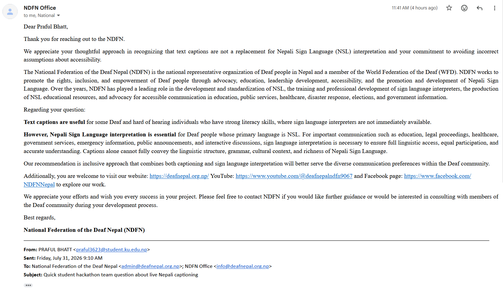
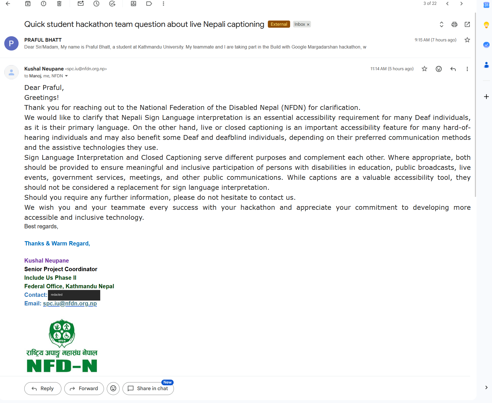

# Who we asked, and what they told us

We started out building a general Nepali captioning tool for videos and podcasts. Before
committing to it we emailed the organisations who would have to live with the result: the
National Federation of the Deaf Nepal (NDFN), the National Federation of the Disabled Nepal
(NFDN), Shruti Nepal, AFAN, and Access Planet.

Two replied the same morning, and both corrected us in the same way.

## NDFN

NDFN is the national representative organisation of Deaf people in Nepal and a member of the
World Federation of the Deaf. Their reply said text captions are useful for some Deaf and
hard-of-hearing people with strong literacy skills, in situations where an interpreter is not
immediately available, but that Nepali Sign Language interpretation is essential for Deaf
people whose primary language is NSL. Their words: captions alone cannot fully convey the
linguistic structure, grammar, cultural context and richness of Nepali Sign Language.

They recommended an inclusive approach that provides both.

## NFDN

Kushal Neupane, Senior Project Coordinator for Include Us Phase II at NFDN, said the same
thing from the disability sector side. Sign language interpretation and closed captioning
serve different purposes and complement each other, and where appropriate both should be
provided in education, public broadcasts, live events, government services and meetings.
Captions should not be treated as a replacement for interpretation.

A direct phone number in the signature block of this screenshot is covered, since it is a
third party's personal contact detail and was not ours to publish.

## What changed because of it

That correction is what narrowed the scope, and it happened before we wrote model code
rather than after the pitch.

Verse is not a Deaf accessibility product and we stopped describing it as one. It is
captioning for hard-of-hearing people, for people who lost hearing later in life, and for
deafblind users whose assistive technology reads text. That group grows with age and hearing
loss, and it is served by very little in Nepali and by nothing at all in Maithili, which is
the second most spoken language in the country.

We then spent about half an hour on a call with Kushal Neupane, who confirmed the use case
is real and offered to help facilitate a pilot. A session with hard-of-hearing users was
booked for the day after the submission deadline. We would rather say that plainly than
imply we had already done user testing.

Two Kathmandu University researchers also gave us time. Saugat Singh, whose master's thesis
built an isolated Nepali Sign Language recogniser with the Kavre School for the Deaf, shared
additional caption data and pointed us to further resources. Bipesh Raj Subedi from the
Information and Language Processing Research Lab advised on the language side.

## Acknowledgements

National Federation of the Deaf Nepal. Kushal Neupane, National Federation of the Disabled
Nepal. Saugat Singh and Bipesh Raj Subedi, DoCSE and ILPRL, Kathmandu University.
